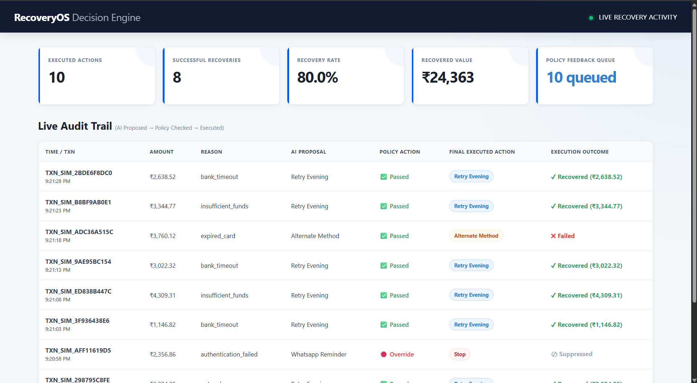
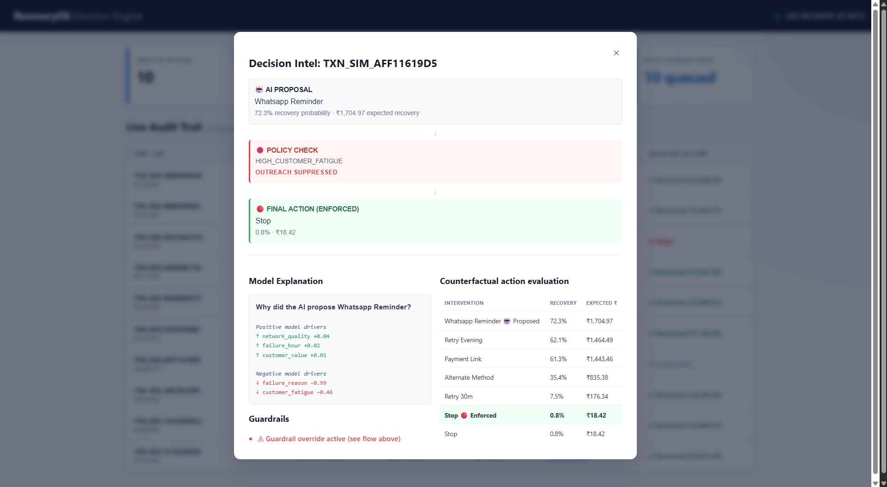

```markdown
# RecoveryOS 🚀
### AI-Powered Revenue Recovery Engine

> **Every failed payment is a decision opportunity.**

RecoveryOS is an AI-powered revenue recovery decision engine designed to turn failed payments into **recoverable revenue**.

Instead of blindly retrying a failed payment, RecoveryOS analyzes payment, customer, merchant, timing, network, and fatigue signals to determine:

**What action should be taken next to maximize expected recovered revenue?**

---

## 🎯 Problem

A failed payment does not necessarily mean lost revenue.

Traditional recovery systems often rely on:

- Generic retry schedules
- Fixed business rules
- Same recovery action for different customers
- Limited context about failure reasons
- Excessive retries and customer outreach
- No closed feedback loop

The key problem is:

> **Which recovery action should be taken for this specific failed payment?**

---

## 💡 Solution

RecoveryOS creates a closed-loop recovery system:

```text
Failed Payment
      ↓
Context & Feature Engine
      ↓
AI Recovery Predictor
      ↓
Evaluate Recovery Actions
      ↓
Expected Revenue Optimizer
      ↓
Policy & Guardrails
      ↓
Final Recovery Action
      ↓
Simulated Execution
      ↓
Outcome Monitoring
      ↓
Audit + Feedback

```

The system combines AI prediction + economic optimization + policy controls.

---

## 🧠 How It Works

For every failed payment, RecoveryOS evaluates six possible actions:

| Action | Description |
| --- | --- |
| `retry_30m` | Retry after 30 minutes |
| `retry_evening` | Retry during the evening |
| `payment_link` | Send a payment link |
| `whatsapp_reminder` | Send a WhatsApp reminder |
| `alternate_method` | Suggest an alternate payment method |
| `stop` | Stop recovery attempts |

For each action, the model estimates the probability of recovery.

The decision engine then calculates:

$$Expected Revenue = P(Recovery \mid Customer, Context, Action) \times Amount - Cost$$

The action with the highest expected value becomes the AI proposal.

Before execution, the proposal passes through policy guardrails.

---

## 🛡️ Policy & Guardrails

RecoveryOS is designed so that AI recommendations do not directly execute without policy checks.

Guardrails include:

* Maximum retry limit
* Customer fatigue threshold
* Hard failure detection
* Action eligibility
* Non-positive expected revenue $\rightarrow$ `STOP`
* Recovery suppression
* Final action override



**Example:**

```text
AI Proposal: Retry Evening
      ↓
[MAX_RETRIES_EXCEEDED]
      ↓
Retry Blocked
      ↓
Fallback: Alternate Method
      ↓
Execute

```

This creates a clear separation between:
**AI Recommendation $\rightarrow$ Policy Decision $\rightarrow$ Executable Action**

---

## 🤖 AI Model

RecoveryOS uses an action-conditioned CatBoost binary classifier.

### Training Dataset

* 20M synthetic transactions
* ~2M customers
* 20 model features
* Customer-level split (80% Train / 10% Validation / 10% Test)

### Dataset Split

| Dataset | Transactions |
| --- | --- |
| Train | ~16.0M |
| Validation | ~2.0M |
| Test | ~2.0M |

Customer-level splitting ensures that customers in the held-out test set are completely unseen during training.

### Model Performance

| Metric | Result |
| --- | --- |
| ROC-AUC | 0.7767 |
| PR-AUC | 0.8578 |
| Oracle Efficiency | 99.70% |

### Training Configuration

* **GPU:** Tesla T4
* **Depth:** 8
* **Learning Rate:** 0.07
* **Maximum Iterations:** 2500
* **Early Stopping:** 100
* **Best Iteration:** 311
* **Training Time:** ~22 minutes

---

## 📊 Benchmark Results

Evaluation was performed on:

* 1,999,119 transactions
* 199,827 unseen customers
* ₹310.6 Cr synthetic failed transaction value

### RecoveryOS Performance

| Metric | RecoveryOS |
| --- | --- |
| Recovery Rate | 87.09% |
| Expected Recovered Revenue | ₹270.5 Cr |
| Oracle Efficiency | 99.70% |

### Improvement

RecoveryOS achieved approximately:

* **+₹66.1 Cr** vs historical policy
* **+₹14.8 Cr** vs always-retry-evening
* **+₹14.0 Cr** vs simple rules

> ⚠️ All transaction, revenue, and benchmark values are synthetic and used for demonstrating the recovery engine.

---

## 🔍 Explainable Decisions

RecoveryOS does not only output an action. Every decision can include:

* Selected action
* Recovery probability
* Expected revenue
* Decision margin
* Positive drivers
* Negative drivers
* Counterfactual action probabilities
* Guardrail results
* Final executable action

**Example:**

```text
AI Proposal: WhatsApp Reminder
Recovery Probability: 90.2%
Expected Revenue: ₹1,266.27

Top Positive Drivers:
• Previous Success Rate
• Failure Reason
• Network Quality

Top Negative Drivers:
• Customer Fatigue
• Salary Window

```

The system uses SHAP-based explanations for model interpretability.

---

## 🔄 Closed-Loop Recovery

RecoveryOS is designed around a continuous recovery feedback loop:

```text
Payment Failure
      ↓
AI Decision
      ↓
Policy Check
      ↓
Action Execution
      ↓
Payment Outcome (Recovered / Failed / Suppressed)
      ↓
Audit Log
      ↓
Policy Feedback
      ↓
Future Calibration / Retraining

```

The current implementation captures labeled outcomes and makes them available for future policy calibration and model improvement.

---

## 🖥️ Dashboard

RecoveryOS includes a live dashboard for monitoring recovery decisions.

### Dashboard Provides:

* Executed Actions & Successful Recoveries
* Recovery Rate & Recovered Value
* Policy Feedback & Decision Audit Table
* AI Proposal vs Final Action
* Guardrail Status
* SHAP Explanations & Counterfactual Actions

**Example dashboard flow:**

```text
Transaction → AI Recommendation → Policy Check → Final Action → Outcome

```

---

## 🏗️ Architecture

```text
┌────────────────────────────────────────┐
│          Failed Payment Event          │
                   │
                   ▼
┌────────────────────────────────────────┐
│            Feature Builder             │
                   │
                   ▼
┌────────────────────────────────────────┐
│           Recovery Predictor           │
│                CatBoost                │
                   │
                   ▼
┌────────────────────────────────────────┐
│           Action Evaluation            │
│               6 Actions                │
                   │
                   ▼
┌────────────────────────────────────────┐
│        Expected Revenue Optimizer      │
                   │
                   ▼
┌────────────────────────────────────────┐
│          Policy & Guardrails           │
                   │
                   ▼
┌────────────────────────────────────────┐
│              Final Action              │
                   │
                   ▼
┌────────────────────────────────────────┐
│          Simulated Execution           │
                   │
                   ▼
┌────────────────────────────────────────┐
│          Outcome + Audit Log           │
└────────────────────────────────────────┘

```

---

## 📁 Project Structure

```text
recovery_os_project/
│
├── app.py
├── requirements.txt
├── .env
│
├── config/
│   └── firebase_service_account.json
│
├── model/
│   └── catboost_recovery_laptop.cbm
│
├── services/
│   ├── __init__.py
│   ├── ai_engine.py
│   └── database.py
│
├── static/
│   ├── css/
│   │   └── style.css
│   └── js/
│       └── dashboard.js
│
├── templates/
│   └── index.html
│
├── simulate_traffic.py
│
└── README.md

```

---

## ⚙️ Technology Stack

* **AI / ML:** Python, CatBoost, SHAP, Pandas, NumPy
* **Backend:** Flask, REST API
* **Database:** Firebase Firestore
* **Frontend:** HTML, CSS, JavaScript
* **Infrastructure / Demo:** Google Colab, Tesla T4 GPU, Synthetic payment-event simulator

---

## 🚀 Getting Started

### 1. Clone the Repository

```bash
git clone <YOUR_GITHUB_REPOSITORY_URL>
cd recovery_os_project

```

### 2. Create a Virtual Environment

**Windows:**

```cmd
python -m venv venv
venv\Scripts\activate

```

**Linux / macOS:**

```bash
python3 -m venv venv
source venv/bin/activate

```

### 3. Install Dependencies

```bash
pip install -r requirements.txt

```

### 4. Configure Firebase

Place your Firebase service account file at:
`config/firebase_service_account.json`

Configure environment variables in `.env` as required by the application.

> 🔒 **Never commit Firebase credentials or `.env` files to GitHub.**

---

## ▶️ Run the Application

Start the Flask server:

```bash
python app.py

```

The dashboard will be available at:
`http://127.0.0.1:5000`

---

## 🧪 Run the Payment Simulator

In another terminal, run:

```bash
python simulate_traffic.py

```

The simulator continuously generates failed-payment events and sends them to the RecoveryOS API.

**Example flow:**

```text
Payment Failed → RecoveryOS → AI Proposal: Retry Evening → Policy: PASSED → Final Action: Retry Evening → Outcome: RECOVERED

```

The dashboard updates as simulated transactions are processed.

---

## 🔐 Security

Sensitive files should never be committed.

Recommended `.gitignore`:

```text
.env
config/firebase_service_account.json
__pycache__/
*.pyc
venv/

```

---

## 🧩 API

### Failed Payment Endpoint

`POST /api/payment/failed`

**Example request:**

```json
{
  "transaction_id": "TXN_SIM_12345",
  "amount": 2500,
  "payment_method": "upi",
  "failure_reason": "bank_timeout",
  "device": "android",
  "location": "Lucknow",
  "previous_success_rate": 0.82,
  "days_since_last_payment": 12,
  "subscription_age_days": 180,
  "historical_retries": 1,
  "time_since_failure_mins": 5,
  "customer_value": "high",
  "merchant_category": "ecommerce",
  "failure_hour": 18,
  "day_of_week": 5,
  "day_of_month": 5,
  "is_weekend": 0,
  "is_salary_window": 1,
  "network_quality": 0.85,
  "customer_fatigue": 0.15,
  "observed_intervention": "retry_evening"
}

```

The API returns the AI decision, policy result, final action, and outcome.

---

## 📈 Why RecoveryOS?

**Traditional recovery:**

```text
Payment Failed → Retry → Retry Again → Maybe Recover

```

**RecoveryOS:**

```text
Payment Failed → Understand Context → Predict Recovery → Compare Actions → Optimize Revenue → Apply Guardrails → Execute → Measure → Learn

```

> **The difference:** RecoveryOS does not simply retry payments. It decides how, when, and whether a payment should be recovered.

---

## 🔮 Future Scope

RecoveryOS can be extended to:

* Subscription payment recovery
* Checkout abandonment
* Receivables recovery
* Mandate retry optimization
* Merchant-specific recovery strategies
* Personalized recovery channels
* Voice-based recovery
* WhatsApp recovery workflows
* Continuous policy calibration
* Online experimentation / A-B testing

---

## 🏆 Hackathon Context

Built for the **Razorpay AI Buildathon — AI Revenue Recovery Track**.

The project focuses on:

* Revenue at risk detection
* AI-driven intervention selection
* Bounded recovery execution
* Measured recovery value
* Stopping rules
* Policy compliance
* Auditability
* Closed-loop feedback

---

## ⚠️ Disclaimer

RecoveryOS is a hackathon prototype. All transaction data, customer data, recovery probabilities, and revenue figures used in benchmarking are synthetically generated and do not represent actual Razorpay customer or revenue data. The execution layer in this prototype operates in demo/simulation mode.

---

## 👨‍💻 Team

**RecoveryOS** *Built with AI × Payments × Revenue Optimization*

---

### ⭐ Key Takeaway

> **Don't just retry the payment. Choose the recovery action that maximizes revenue — safely.** > *Detect → Decide → Guard → Recover → Learn*

```

```
